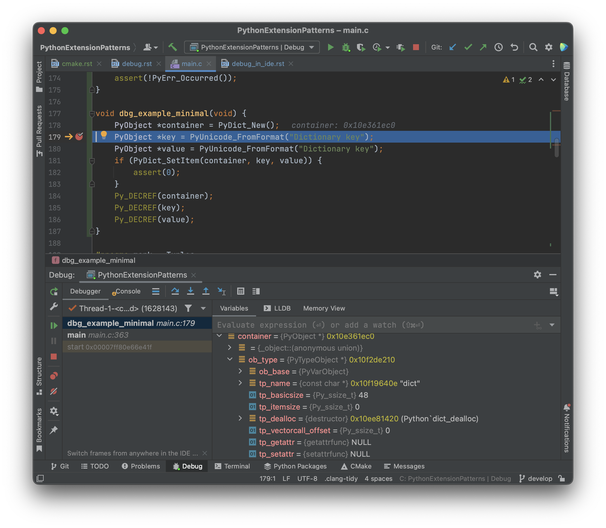
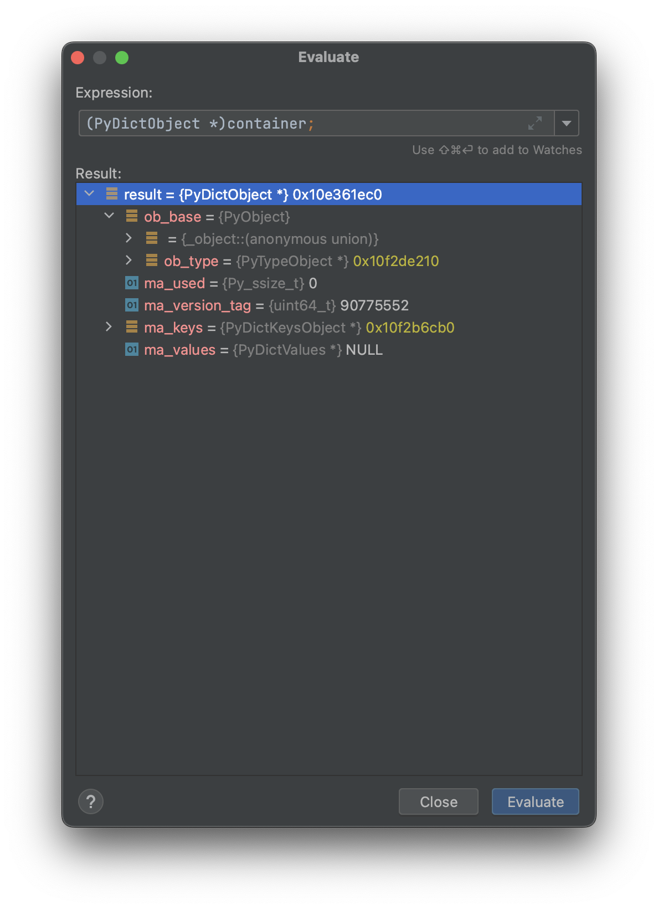

.. moduleauthor:: Paul Ross <apaulross@gmail.com>
.. sectionauthor:: Paul Ross <apaulross@gmail.com>

.. Using CMake

.. highlight:: python
    :linenothreshold: 10

.. highlight:: c
    :linenothreshold: 10

.. toctree::
    :maxdepth: 3

..
    Links, mostly to the Python documentation.
    Specific links are just before the appropriate section.

.. _CMake: https://cmake.org

.. index::
    single: CMake

.. Usage: See the :ref:`debugging.using_cmake-label` chapter

.. _debugging.using_cmake-label:

===========
Using CMake
===========

`CMake`_ is a commonly used cross platform build system.

--------------------------------
A typical ``CMakeLists.txt``
--------------------------------

Here is a typical `CMake`_ file ``CMakeLists.txt`` broken down piece by piece.
This is based on the ``CMakeLists.txt`` file for a project which is named ``MY_PROJECT``.

CMake Introduction
--------------------------------

First the basic introduction to check the version of `CMake`_ and declare the project name:

.. code-block:: cmake

    cmake_minimum_required(VERSION 3.24)
    project(MY_PROJECT)

CMake Language Version Targets
----------------------------------------------

Now set some language versions that this project is targeting:

.. code-block:: cmake

    set(CMAKE_C_STANDARD 11)
    set(CMAKE_CXX_STANDARD 11)

CMake Compiler Options
----------------------------------------------

Set some compiler options, these are the ones that I find most useful:

.. code-block:: cmake

    add_compile_options(
            "-Wall"
            "-Wextra"
            "-Wpedantic"
            "-Werror"
            "-Wfatal-errors"
            "-fexceptions"
            # To allow designated initialisers.
            "-Wno-c99-extensions"
            "-Wno-c++11-extensions"
            "$<$<CONFIG:DEBUG>:-O0;-g3;-ggdb>"
    )

.. index::
    single: CMake; find_package()
    single: CMake; Finding Python

.. _find_package(): https://cmake.org/cmake/help/latest/command/find_package.html
.. _Find Python: https://cmake.org/cmake/help/latest/module/FindPython3.html#module:FindPython3

CMake Find Python Binary and Source
----------------------------------------------

Now we need to find the Python binary to link against.
We use `CMake`_ s builtin function ``find_package()``:

.. code-block:: cmake

    find_package (Python3 3.13 EXACT REQUIRED COMPONENTS Interpreter Development)

This next block tests that Python has been found and writes out the Python specific variables:

.. code-block:: cmake

    IF (Python3_FOUND)
        INCLUDE_DIRECTORIES("${Python3_INCLUDE_DIRS}")
        # See: https://cmake.org/cmake/help/latest/module/FindPython3.html#module:FindPython3
        message("Python3_VERSION:           ${Python3_VERSION}")
        message("Python3_EXECUTABLE:        ${Python3_EXECUTABLE}")
        message("Python3_INTERPRETER_ID:    ${Python3_INTERPRETER_ID}")
        message("Python3_INCLUDE_DIRS:      ${Python3_INCLUDE_DIRS}")
        message("Python3_STDLIB:            ${Python3_STDLIB}")
        message("Python3_STDARCH:           ${Python3_STDARCH}")
        message("Python3_LINK_OPTIONS:      ${Python3_LINK_OPTIONS}")
        message("Python3_LIBRARIES:         ${Python3_LIBRARIES}")
    ELSE ()
        MESSAGE(FATAL_ERROR "Unable to find Python libraries.")
    ENDIF ()

The output might be something like:

.. code-block:: text

    Python3_VERSION:           3.13.1
    Python3_EXECUTABLE:        /Library/Frameworks/Python.framework/Versions/3.13/bin/python3.13
    Python3_INTERPRETER_ID:    Python
    Python3_INCLUDE_DIRS:      /Library/Frameworks/Python.framework/Versions/3.13/include/python3.13
    Python3_STDLIB:            /Library/Frameworks/Python.framework/Versions/3.13/lib/python3.13
    Python3_STDARCH:           /Library/Frameworks/Python.framework/Versions/3.13/lib/python3.13
    Python3_LINK_OPTIONS:      LINKER:-rpath,/Library/Frameworks
    Python3_LIBRARIES:         /Library/Frameworks/Python.framework/Versions/3.13/lib/libpython3.13.dylib

Now add the ``#include``'d directories:

.. code-block:: cmake

    include_directories(
        # Add all your include directories here such as these relative paths:
        src/cpy
        src/cpy/Containers
        src/cpy/Watchers
    )

Add all the source files that need to be compiled into the executable:

.. code-block:: cmake

    add_executable(MY_PROJECT
        src/main.c
        # Add all your other source files here...
    )

Add the paths for the linker:

.. code-block:: cmake

    link_directories(${Python3_LIBRARIES})
    target_link_libraries(${PROJECT_NAME} ${Python3_LIBRARIES})

These messages are useful for debugging the build:

.. code-block:: cmake

    MESSAGE(STATUS "Build type: " ${CMAKE_BUILD_TYPE})
    MESSAGE(STATUS "Library Type: " ${LIB_TYPE})
    MESSAGE(STATUS "Compiler flags:" ${CMAKE_CXX_COMPILE_FLAGS})
    MESSAGE(STATUS "Compiler cxx debug flags:" ${CMAKE_CXX_FLAGS_DEBUG})
    MESSAGE(STATUS "Compiler cxx release flags:" ${CMAKE_CXX_FLAGS_RELEASE})
    MESSAGE(STATUS "Compiler cxx min size flags:" ${CMAKE_CXX_FLAGS_MINSIZEREL})
    MESSAGE(STATUS "Compiler cxx flags:" ${CMAKE_CXX_FLAGS})

The output might be something like:

.. code-block:: text

    -- Build type: Debug
    -- Library Type:
    -- Compiler flags:
    -- Compiler cxx debug flags:-g
    -- Compiler cxx release flags:-O3 -DNDEBUG
    -- Compiler cxx min size flags:-Os -DNDEBUG
    -- Compiler cxx flags:

.. index::
    single: CMake; Variables

CMake Verbose Dump Variables
----------------------------------------------

I like to add this very verbose function to dump out all the `CMake`_ variables.
I find it useful for debugging build issues:

.. code-block:: cmake

    function(dump_cmake_variables)
        message(STATUS "==== dump_cmake_variables()")
        get_cmake_property(_variableNames VARIABLES)
        list (SORT _variableNames)
        foreach (_variableName ${_variableNames})
            if (ARGV0)
                unset(MATCHED)
                string(REGEX MATCH ${ARGV0} MATCHED ${_variableName})
                if (NOT MATCHED)
                    continue()
                endif()
            endif()
            message(STATUS "${_variableName}=${${_variableName}}")
        endforeach()
        message(STATUS "==== dump_cmake_variables() DONE")
    endfunction()

And this can be invoked thus:

.. code-block:: cmake

    dump_cmake_variables()

The output might be something like:

.. code-block:: text

    -- ==== dump_cmake_variables()
    -- APPLE=1
    -- ARGC=0
    -- ARGN=
    -- ARGV=
    -- CMAKE_ADDR2LINE=CMAKE_ADDR2LINE-NOTFOUND
    -- CMAKE_AR=/Applications/Xcode.app/Contents/Developer/Toolchains/XcodeDefault.xctoolchain/usr/bin/ar
    -- CMAKE_AR=/Applications/Xcode.app/Contents/Developer/Toolchains/XcodeDefault.xctoolchain/usr/bin/ar
    -- CMAKE_AUTOGEN_ORIGIN_DEPENDS=ON
    -- CMAKE_AUTOMOC_COMPILER_PREDEFINES=ON
    -- CMAKE_AUTOMOC_MACRO_NAMES=Q_OBJECT;Q_GADGET;Q_NAMESPACE;Q_NAMESPACE_EXPORT
    -- CMAKE_AUTOMOC_PATH_PREFIX=OFF
    -- CMAKE_BASE_NAME=c++
    ...
    -- __ranlib=/Applications/Xcode.app/Contents/Developer/Toolchains/XcodeDefault.xctoolchain/usr/bin/ranlib
    -- _abolute_path=/Applications/Xcode.app/Contents/Developer/Platforms/MacOSX.platform/Developer/Library/Frameworks
    -- _apps=/Applications/Xcode.app/Contents/Developer/Applications
    -- _failed=0
    -- _pff_CMAKE_FRAMEWORK_PATH=
    -- _stderr=
    -- _stdout=/Applications/Xcode.app/Contents/Developer
    -- ==== dump_cmake_variables() DONE

--------------------------------
``main.c``
--------------------------------

So the ``main()`` entry point would look like this:

.. code-block:: c

    int main(int argc, const char *argv[]) {
        printf("Arguments:\n");
        for (int i = 0; i < argc; ++i) {
            printf("[%4d] %s\n", i, argv[i]);
        }

        Py_Initialize();

        int32_t py_version_hex = PY_VERSION_HEX;
        printf("Python version %d.%d.%d Release level: 0x%x Serial: %d Numeric: %12d 0x%08x\n",
               PY_MAJOR_VERSION, PY_MINOR_VERSION, PY_MICRO_VERSION,
               PY_RELEASE_LEVEL, PY_RELEASE_SERIAL,
               py_version_hex, py_version_hex
        );

        /* Your execution code here... */

        printf("Bye, bye!\n");
        return 0;
    }

--------------------------------
``main.c`` Example Usage
--------------------------------

In this example we are hoing to insert a key and value in a dictionary aand step through this in the CLion debugger.
The function to do this is:

.. code-block:: c

    void dbg_example_minimal(void) {
        PyObject *container = PyDict_New();
        PyObject *key = PyUnicode_FromFormat("Dictionary key");
        PyObject *value = PyUnicode_FromFormat("Dictionary key");
        if (PyDict_SetItem(container, key, value)) {
            assert(0);
        }
        Py_DECREF(container);
        Py_DECREF(key);
        Py_DECREF(value);
    }

If we call this from ``main()`` in the debugger we can see the creation of a dictionary:

A ``PyObject *`` is an opaque container, however in this case we can cast to what we know its type is, a
``PyDictObject`` and examine its contents:

--------------------------------
``main.c`` Executing Python Code
--------------------------------

See the :ref:`debug-in-ide-label` section that allows you to
dynamically import your module and examine it in the debugger.

