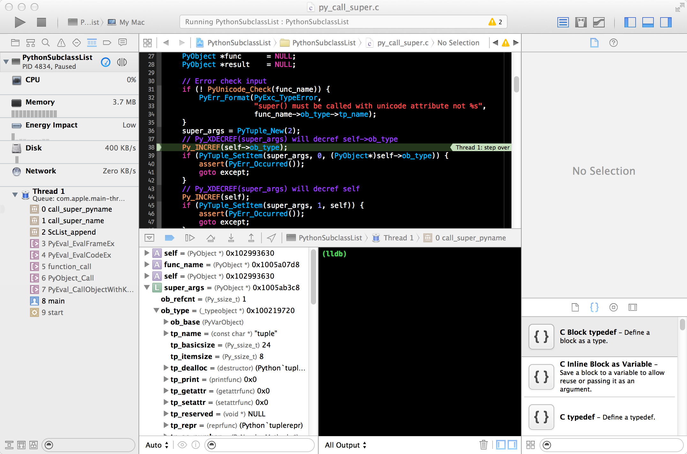

.. highlight:: python
    :linenothreshold: 10

.. highlight:: c
    :linenothreshold: 10

.. toctree::
    :maxdepth: 3

.. _debug-in-ide-label:

===============================================
Debuging Python C Extensions in an IDE
===============================================

``gdb`` and ``lldb`` work well with Python extensions but if you want to step through your C extension in an IDE here is one way to do it.

The basic idea is to compile/link you C extension in you IDE with a ``main()`` function that embeds the Python interpreter which then imports a Python module, say a unit test, that exercises your C extension code.

This ``main()`` entry point is fairly generic and takes two arguments; the name of the Python module to import and the name of the function to run (the function takes no arguments). This way you can choose a unit test and explore your C extension behaviour.

Suppose you have a Python extension ``ScList`` that sub-classes a list and counts the numper of times ``.append(...)`` was called making this count available as a ``.appends`` property. You have a unit test called ``test_sclist.py`` that looks like this with a single function ``test()``:

.. code-block:: python

    import ScList

    def test():
        s = ScList.ScList()
        assert s.appends == 0
        s.append(8)
        assert s.appends == 1

The ``main()`` entry point does this:

#. Check the arguments and initialise the Python interpreter
#. Add the path to the ``test_sclist.py`` to ``sys.paths``.
#. Import ``test_sclist``.
#. Find the function ``test()`` in module ``test_sclist`` and call it.
#. Clean up.

So ``main()`` is quite generic, the only specialisation is the path to your particular unit tests module. Here it is in fragments, the complete ``main()`` is below.

Step 1: Check the arguments and initialise the Python interpreter

.. code-block:: c

    #include <stdio.h>
    #include <Python.h>
    
    /* This is the absolute path to the Python test module that we will add to sys.paths. */
    #define MODULE_DIR "<absolute path to your unit test module>"

    int main(int argc, const char *argv[]) {
        PyObject *pModule   = NULL;
        PyObject *pFunc     = NULL;
        PyObject *pResult   = NULL;
        int return_value = 0;
    
        Py_SetProgramName(argv[0]);
        Py_Initialize();

Step 2: Add the path to the ``test_sclist.py`` to ``sys.paths``.

.. code-block:: c

        PyRun_SimpleString("import sys\n"
                           "sys.path.append(\""
                           MODULE_DIR
                           "\")\n"
                           );

Step 3: Import ``test_sclist``.

.. code-block:: c

        pModule = PyImport_ImportModule(argv[1]);

Step 4: Find the function ``test()`` in ``test_sclist`` and call it.

.. code-block:: c

        if (pModule) {
            pFunc = PyObject_GetAttrString(pModule, argv[2]);
            if (pFunc && PyCallable_Check(pFunc)) {
                pResult = PyObject_CallObject(pFunc, NULL);
                if (pResult) {
                    printf("pyxcode: Call succeeded\n");
                    Py_DECREF(pResult);
                } else {
                    Py_DECREF(pFunc);
                    Py_DECREF(pModule);
                    fprintf(stderr,"pyxcode: Function call failed\n");
                    return_value = 1;
                    goto except;
                }
            } else {
                fprintf(stderr, "pyxcode: Can not call function \"%s\"\n", argv[2]);
                return_value = 1;
                goto except;
            }
            Py_XDECREF(pFunc);
            Py_DECREF(pModule);

Step 5: Clean up.

.. code-block:: c

        } else {
            fprintf(stderr, "pyxcode: Failed to load module \"%s\"\n", argv[1]);
            return_value = 1;
            goto except;
        }
        assert(! PyErr_Occurred());
        goto finally;
    except:
        assert(PyErr_Occurred());
        PyErr_Print();
    finally:
        Py_Finalize();
        return return_value;
    }

The complete code for ``main()`` is here:

.. code-block:: c

    #include <stdio.h>
    #include <Python.h>
    
    /* This is the absolute path to the Python test module that we will add to sys.paths. */
    #define MODULE_DIR "<absolute path to your unit test module>"

    int main(int argc, const char *argv[]) {
        PyObject *pModule   = NULL;
        PyObject *pFunc     = NULL;
        PyObject *pResult   = NULL;
        int return_value = 0;
    
        Py_SetProgramName(argv[0]);
        Py_Initialize();
        if (argc != 3) {
            fprintf(stderr, "Wrong arguments. Usage: pyxcode module function\n");
            return_value = 1;
            goto except;
        }
        PyRun_SimpleString("import sys\n"
                           "sys.path.append(\""
                           MODULE_DIR
                           "\")\n"
                           );
        pModule = PyImport_ImportModule(argv[1]);
        if (pModule) {
            pFunc = PyObject_GetAttrString(pModule, argv[2]);
            if (pFunc && PyCallable_Check(pFunc)) {
                pResult = PyObject_CallObject(pFunc, NULL);
                if (pResult) {
                    printf("pyxcode: Call succeeded\n");
                    Py_DECREF(pResult);
                } else {
                    Py_DECREF(pFunc);
                    Py_DECREF(pModule);
                    fprintf(stderr,"pyxcode: Function call failed\n");
                    return_value = 1;
                    goto except;
                }
            } else {
                fprintf(stderr, "pyxcode: Can not call function \"%s\"\n", argv[2]);
                return_value = 1;
                goto except;
            }
            Py_XDECREF(pFunc);
            Py_DECREF(pModule);
        } else {
            fprintf(stderr, "pyxcode: Failed to load module \"%s\"\n", argv[1]);
            return_value = 1;
            goto except;
        }
        assert(! PyErr_Occurred());
        goto finally;
    except:
        assert(PyErr_Occurred());
        PyErr_Print();
    finally:
        Py_Finalize();
        return return_value;
    }

--------------------------------------------
Debuging Python C Extensions in Xcode
--------------------------------------------

Build this code in Xcode and set it to run with the command line arguments: ``test_sclist test`` and you can set break points in you extension, like this:

TODO: Commit the full code for this.

--------------------------------------------
Debuging Python C Extensions in Eclipse
--------------------------------------------

The same ``main()`` can be used.

TODO: The intern can do this.
